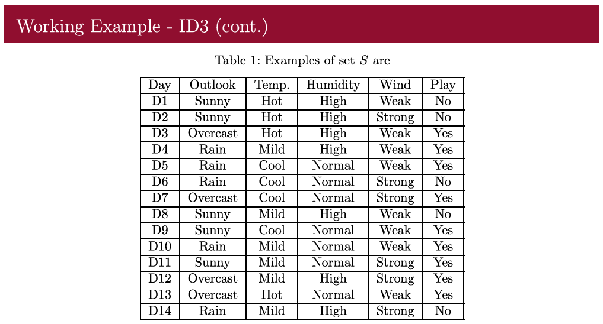
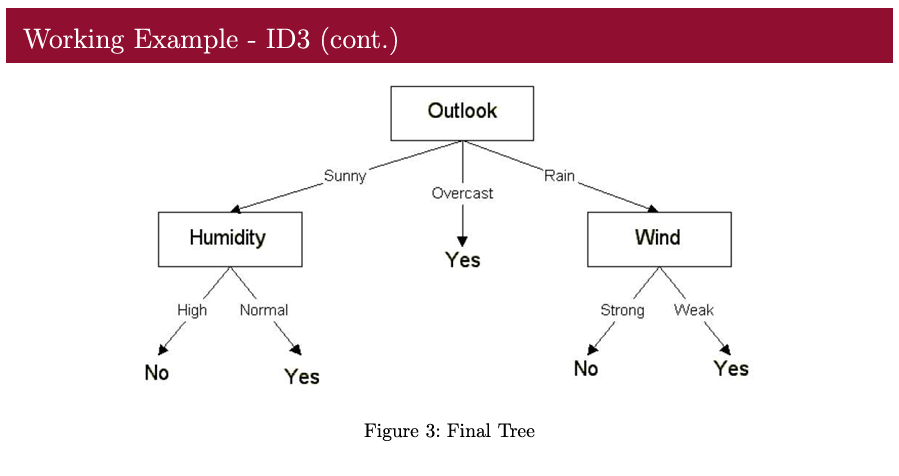

# ID3 Decision Tree Classifier

A from-scratch Python implementation of the **ID3 decision tree** algorithm, demonstrated on the classic **Play Tennis** dataset. Ideal for learning how decision trees work, including entropy, information gain, and recursive tree building.

---

## 📊 Dataset

This screenshot is taken from a machine learning lecture by **T.G.I. Fernando**, showing the "Play Tennis" dataset with four features:
- **Outlook** (Sunny, Overcast, Rain)
- **Temperature** (Hot, Mild, Cool)
- **Humidity** (High, Normal)
- **Wind** (Weak, Strong)

Each record is labeled **Yes** (play) or **No** (don’t play).



---

## 🔍 How It Works

1. **Entropy Calculation**  
   Entropy measures the impurity of a set:
   ```math
   H(S) = -\sum_{c} p(c) \log_2 p(c)
   ```
2. **Information Gain**  
   Gain quantifies the reduction in entropy by splitting on a feature:
   ```math
   Gain(S, F) = H(S) - \sum_{f \in values(F)} \frac{|S_f|}{|S|} H(S_f)
   ```
3. **ID3 Algorithm**  
   - At each node, choose the feature with the highest information gain.  
   - Split the dataset into subsets by feature values.  
   - Recursively repeat until all nodes are pure or a maximum depth is reached.

---


---

## 📐 Notation

- S - set of examples  
- F - a feature from the set of all features  
- f - a possible value of feature \(F\)  
- S_f - number of members of \(S\) that have value \(f\) for feature \(F\)  
- S - total number of examples in set \(S\)

## 🌳 Final Decision Tree

The resulting decision tree correctly classifies the Play Tennis dataset.  


- **Root node**: split on **Outlook**  
- **Branches**:
  - **Overcast** → Always **Yes**  
  - **Rain** → Split on **Wind**  
  - **Sunny** → Split on **Humidity**  

---

## 🚀 Usage

1. **Clone the repository**  
   ```bash
   git clone https://github.com/kavinduhcolombage/ID3_Decision_Tree.git
   cd ID3_Decision_Tree
   ```
2. **Install dependencies**  
   ```bash
   pip install numpy pandas
   ```
3. **Run the example**  
   ```bash
   python "ID3 decision tree.py"
   ```
   This will output the learned tree structure.

---

## 👩‍🏫 Learning Context

This project was created for **self-study and demonstration** to gain hands-on knowledge of how the ID3 decision tree algorithm works.  
Some visuals in this project, such as screenshots, are taken from the Machine Learning lecture notes of Prof T.G.I. Fernando

---

